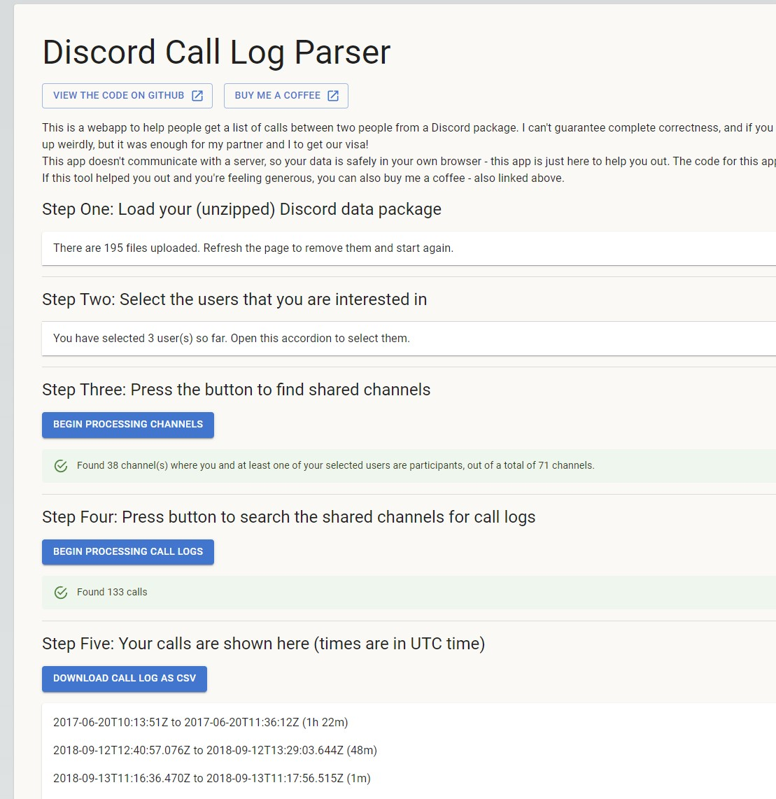

# Discord Call Log

**Please note: This program relies on analytics events being enabled in Discord (under User Settings -> Use data to improve Discord). If you don't have this enabled, this program will probably not be able to help you :(**

Parses the data package provided by Discord to get a record of calls between two people.

In 2020, I needed a log of the calls made between myself and someone else for an official document. Unfortunately Discord's data package doesn't provide that out of the box, and scrolling through message history looking for "ABC started a call for XYZ hours" sounded like a nightmare, so I made this.

Since then, I've had a handful of people contact me because they also need to do something similar and in 2023 I decided to rework my original C# code entirely to build a nice UI to make it easier for people to use. I hope it comes in handy.

The site is hosted here for use: [https://discord-call-log.vercel.app/](https://discord-call-log.vercel.app/)

## Screenshot



## Development

This is a Nextjs app. Run the development server:

```bash
npm run dev
# or
yarn dev
# or
pnpm dev
```

Opens on [http://localhost:3000](http://localhost:3000)
